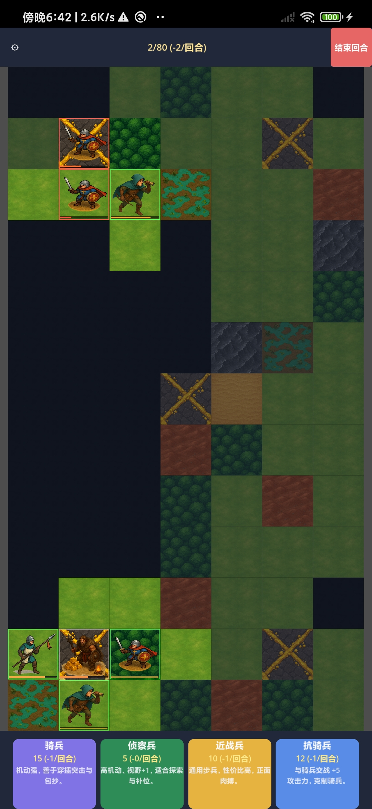

# Tactics Demo

*A bite-size, turn-based grid tactics game for Windows & Android.*

Recruit units, contest mines for income, and use terrain and fog of war to outmaneuver your opponent.  
Every tile matters—forests and hills change mobility and defense, rivers block attacks, fords open crossings.  
Units can fortify, level up, flank, and some counter others (e.g., anti-cavalry). Play **PVE** against a fast AI,
or **PVP** over LAN/Internet (Host/Join). Maps are synchronized via a shared RNG seed so both players see the same world.

## Download
- **Windows**: grab the latest release ZIP from the [Releases](/releases) page (contains `windows.exe` + `windows.pck`).
- **Android**: install the `.apk` from [Releases](/releases).

## How to Play (quick)
- Click a unit card to **recruit**; spawn on your edge row.
- **Move** and **attack** on your turn; rivers block attacks, hills/forests affect stats.
- **Fortify** to hold ground; **upgrade** when eligible; flanking grants bonuses.
- Win by pushing your advantage and defeating the enemy army.

## Multiplayer (PVP)
- **Host:** Main Menu → PVP → *Create Room (Host)*. Share your IP (e.g., `192.168.x.x`) and port `24565`.
- **Join:** Main Menu → PVP → enter the host’s IP → *Join*.  
  > Internet play may require port-forwarding or a VPN/LAN tool.

## Status
Early demo; feedback and bug reports are welcome.
